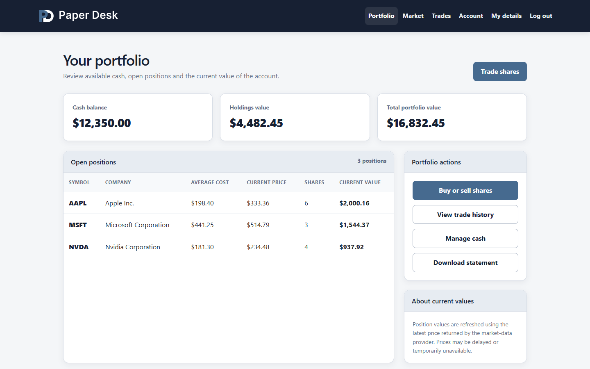
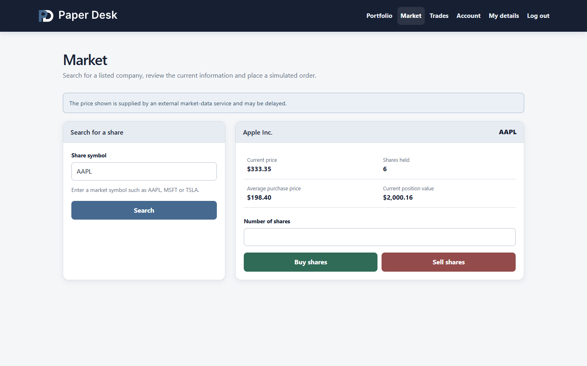
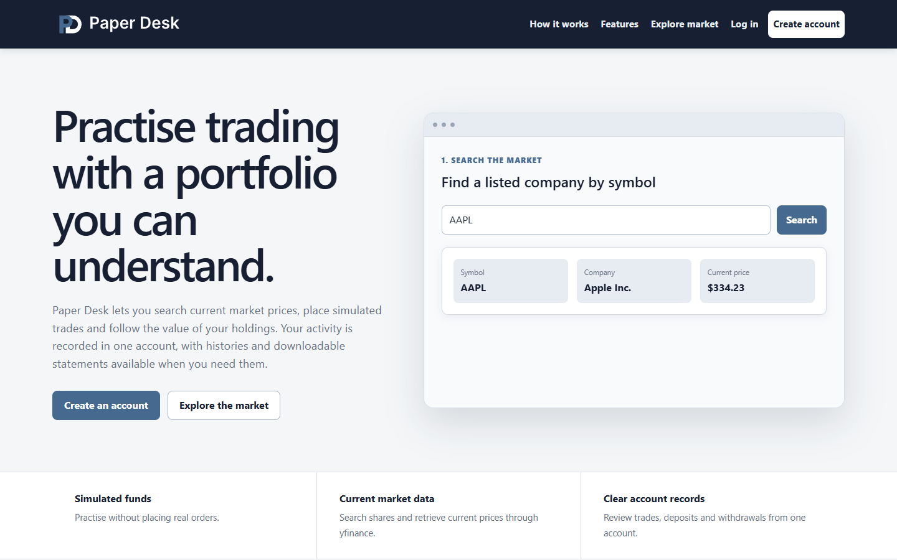
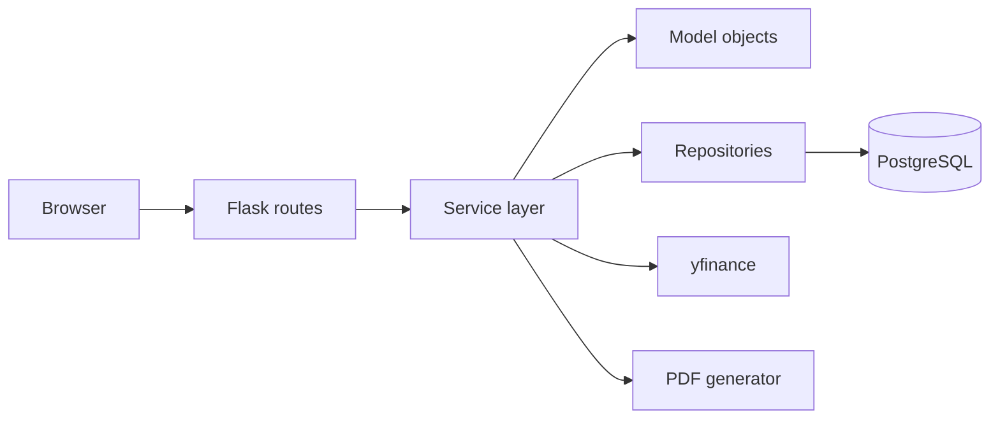
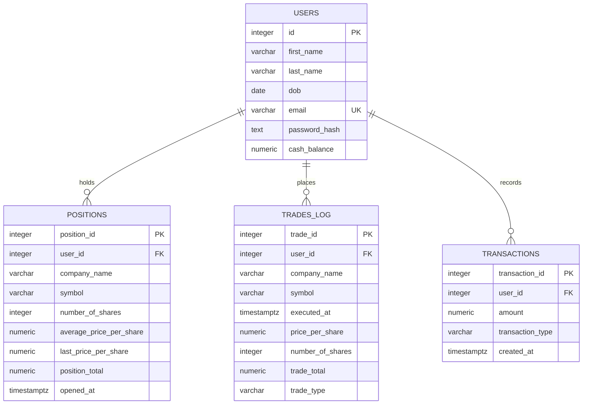

<p align="center">
  
</p>

# Paper Desk

Paper Desk is a paper-trading application built with Flask and PostgreSQL. It allows users to practise buying and selling shares with simulated funds, follow the value of their portfolio using current market data, and download records of their activity.

## Screenshots

### Portfolio



### Market



### Public landing page



## Features

- Account registration, session authentication and password hashing
- CSRF protection for forms that change application data
- Current share prices supplied through yfinance
- Simulated buy and sell orders
- Portfolio, cash balance and open-position tracking
- Deposits and withdrawals with a separate transaction history
- Date-filtered trade and transaction records
- Downloadable PDF portfolio, trade and transaction statements

## Technology

The application uses Python, Flask and Jinja for the server-rendered interface. PostgreSQL stores application data, while Alembic manages the database schema. Market information is retrieved through yfinance, and pandas and ReportLab are used when producing PDF statements. The test suite uses pytest.

## Application structure

Paper Desk follows a route, service and repository structure. Flask routes receive requests and decide which page or response to return. Services apply the business rules, create model objects and coordinate database work. Repositories contain the SQL used to read and update PostgreSQL.



For example, placing an order begins with the `/place_order` route. The application retrieves the selected share through yfinance and passes a `Stock` object to the trading service. A purchase creates a trade record and an open position, then deducts the cost from the user's cash balance. These changes are committed together. A sale works through the user's oldest matching positions, closes or updates them as required, records the trade and returns the proceeds to the cash balance.

When a portfolio is opened, the position service retrieves current prices for the shares held by the user. It updates the valuation of each open position, groups positions by symbol and combines their value with the user's available cash.

## Data model

The database contains four tables. A user can have multiple open positions, trade records and account transactions. Foreign keys use cascading deletion so that removing an account also removes its associated records.



Each purchase is stored as an individual open position. This allows a later sale to work through positions in the order in which they were created. The `trades_log` table preserves completed buy and sell activity, while `transactions` records deposits and withdrawals separately. The database also enforces positive monetary values and share quantities, valid trade and transaction types, unique lower-case email addresses, and non-negative cash balances.

## Running locally

Python 3 and PostgreSQL are required.

1. Clone the repository and create a virtual environment.

   ```bash
   git clone https://github.com/alexander-kireev/paperdesk.git
   cd paperdesk
   python -m venv .venv
   ```

2. Activate the environment and install the dependencies.

   Windows PowerShell:

   ```powershell
   .\.venv\Scripts\Activate.ps1
   python -m pip install -r requirements-dev.txt
   ```

   macOS or Linux:

   ```bash
   source .venv/bin/activate
   python -m pip install -r requirements-dev.txt
   ```

3. Create a PostgreSQL user and database.

   ```sql
   CREATE USER paperdesk_user WITH PASSWORD 'choose-a-password';
   CREATE DATABASE paperdesk OWNER paperdesk_user;
   ```

4. Copy `.env.example` to `.env` and provide the following values:

   | Variable | Purpose |
   | --- | --- |
   | `SECRET_KEY` | Signs Flask sessions and CSRF tokens |
   | `DB_HOST` | PostgreSQL host, normally `localhost` |
   | `DB_PORT` | PostgreSQL port |
   | `DB_NAME` | Database name |
   | `DB_USER` | Database user |
   | `DB_PASSWORD` | Database password |
   | `DATABASE_URL` | Optional cloud database URL which replaces the five `DB_*` values |

5. Apply the database migration and start the application.

   ```bash
   python -m alembic upgrade head
   python -m app.app
   ```

The application will be available at `http://127.0.0.1:5000`.

## Deployment

Paper Desk can be deployed using a free Render web service and a free Neon
PostgreSQL database. The included `render.yaml` installs the runtime
dependencies, applies the Alembic migration and starts the application with
Gunicorn.

1. Create a Neon project and copy its pooled PostgreSQL connection URL.
2. In Render, create a new Blueprint from the `main` branch of this repository.
3. Enter the Neon connection URL when Render requests `DATABASE_URL`.
4. Deploy the Blueprint. Render generates `SECRET_KEY` automatically.

The Render service uses the free compute plan and checks `/` to confirm that a
deployment is healthy. Free services sleep while inactive, so the first request
after a period without traffic may take longer.

## Tests

The tests cover model calculations, validation and service behaviour, together with the main route responses. Run them from the repository root:

```bash
python -m pytest
```

## Project scope

Paper Desk was developed as a student project to explore authentication, relational data, external market data and transaction-based workflows in a Flask application. Market information may be delayed or temporarily unavailable because it depends on an external data source.
